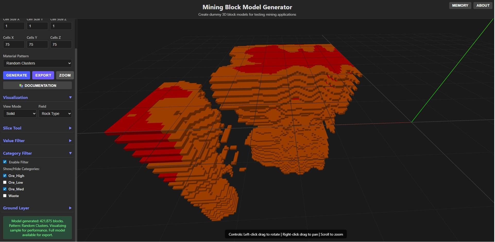
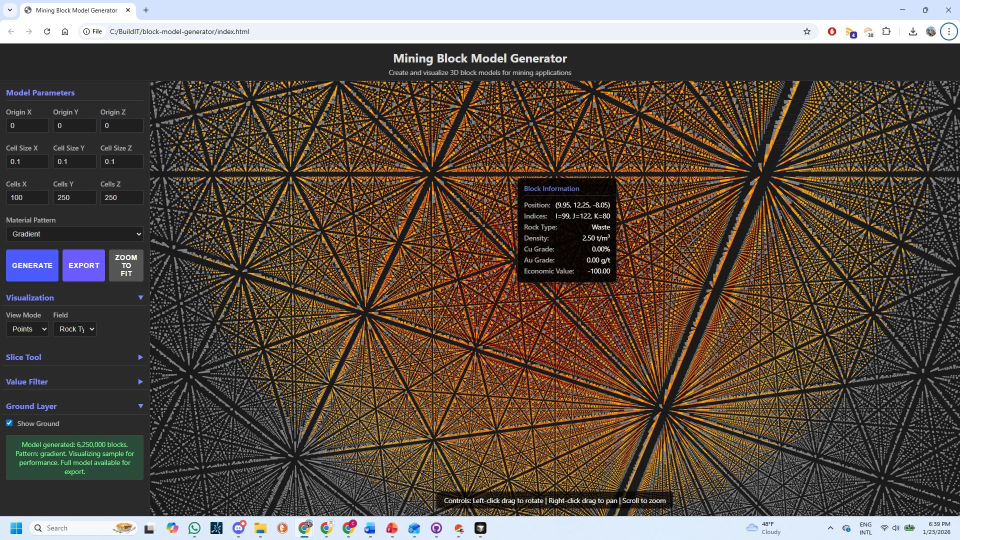

# Mining Block Model Generator



A powerful web-based tool for generating realistic 3D block models for mining and petroleum applications. Create dummy block models for testing mining software, visualization, training, and data analysis.


## 🌟 Features

### Material Patterns (12 Available)
- **Basic Patterns**: Uniform, Layered, Gradient, Checkerboard, Random
- **Geological Patterns**: Single Ore Horizon, Inclined Vein, Random Clusters
- **Advanced Ore Bodies**: 
  - Ellipsoid Ore Body (massive sulfide, skarn, VMS deposits)
  - Vein/Structural Ore Body (epithermal gold, mesothermal veins)
  - Porphyry-Style Zoning (porphyry Cu-Au deposits)
- **Petroleum Geology**: Salt Dome Reservoir (oil/gas traps)

### 3D Visualization
- Interactive 3D rendering with Three.js
- Multiple view modes: Solid, Points, Transparent, Squares, Slices
- Color-coded visualization by: Rock Type, Density, Cu Grade, Au Grade, Economic Value
- Real-time camera controls (rotate, pan, zoom)
- Block tooltips with detailed information
- **Save Viewport Image**: Export the current 3D view as a PNG image
- **Model Statistics Display**: On-canvas button opens detailed statistics modal



### Advanced Tools
- **Slice Tool**: Interactive cross-section viewer with camera-aware drag handles
  - View cross-sections along X, Y, or Z axes
  - Drag handles (bidirectional arrows) for intuitive slice positioning
  - Linear drag mapping for precise control
  - Visual feedback with color-coded handles (red/blue arrows, green shaft)
- **Value Filter**: Filter blocks by economic value threshold
- **Category Filter**: Show/hide specific rock types or categories
- **Ground Layer**: Display ground surface for spatial context

### Data Export
- Export to CSV format compatible with:
  - MiningMath
  - Vulcan
  - Surpac
  - MineSight
  - Datamine
- Standardized block model schema
- Automatic air block filtering
- Configurable field inclusion

### Performance
- Automatic caching for large models (>50K blocks)
- Optimized rendering for models up to 100K+ blocks
- Memory monitoring tools
- Efficient localStorage management

### Gamification Features
- **Statistics Dashboard**: Track your usage, patterns explored, and model characteristics
  - View total models generated, exports, and session statistics
  - See which patterns you've tried and most used patterns
  - Monitor feature usage (view modes, tools)
  - Track model characteristics (largest model, average size, total volume)
  - Accessible via user icon button in header
- **Model Statistics Display**: View detailed statistics for each generated model
  - On-canvas circular button (lower left) opens detailed statistics modal
  - Block count, volume, and dimensions displayed in compact table format
  - Ore vs waste percentages
  - Zone distribution
  - Grade ranges (Cu, Au) if available
  - Economic value statistics
  - Interesting facts about your model
- **Model Gallery**: Save and reload your favorite models with full state preservation
  - Save models with custom names
  - **Saves complete visualization state**: view mode, field, slice settings, filters, ground layer
  - **Saves camera position**: exact viewing angle and position restored on load
  - **Saves random seed**: regenerates identical patterns for reproducible results
  - Quick access to saved model parameters
  - Automatic model regeneration from saved parameters
  - Gallery limited to 50 models (most recent kept)
  - Accessible via gallery icon button in header

### User Interface
- **Modern Icon-Based Design**: Font Awesome icons replace text labels for cleaner interface
  - All buttons use icon-only design with tooltips on hover
  - Consistent styling and hover effects throughout
  - Responsive button sizing and spacing
- **Header Toolbar**: Quick access to key features
  - Language selector (flag icon) - Switch between English, Spanish, French
  - Statistics dashboard (user icon) - View usage statistics with badge count
  - Model gallery (images icon) - Access saved models with badge count
  - Documentation (question mark icon) - Open interactive help
  - About (info icon) - Application information and memory monitoring
- **Control Panel**: Main action buttons with icon-only design
  - Generate (play icon) - Create new model
  - Zoom to Fit (zoom icon) - Reset camera view
  - Export (download icon) - Download CSV file
  - Save Model (star icon) - Save to gallery (opens name dialog)
  - Save Image (camera icon) - Export viewport as PNG
- **On-Canvas Controls**: 
  - Model Statistics button (circular, lower left) - Opens detailed statistics modal
- **Internationalization**: Full support for English, Spanish, and French
  - Automatic language detection based on browser settings
  - All UI elements, buttons, labels, and messages translated
  - Tooltips and status messages localized
  - Language preference saved in browser storage

## 🚀 Quick Start

### Installation

No installation required! This is a pure client-side web application.

1. **Clone the repository**:
   ```bash
   git clone https://github.com/yourusername/block-model-generator.git
   cd block-model-generator
   ```

2. **Open in a web browser**:
   - Simply open `index.html` in any modern web browser
   - Or serve via a local web server:
     ```bash
     # Using Python 3
     python -m http.server 8000
     
     # Using Node.js (http-server)
     npx http-server
     
     # Using PHP
     php -S localhost:8000
     ```
   - Navigate to `http://localhost:8000` in your browser

### Requirements

- Modern web browser with JavaScript enabled
- No server-side dependencies
- No build process required

**Recommended Browsers**:
- Chrome/Edge (latest)
- Firefox (latest)
- Safari (latest)

## 📖 Usage

### Basic Workflow

1. **Set Model Parameters**:
   - Define origin coordinates (X, Y, Z)
   - Set cell size for each dimension
   - Specify grid dimensions (number of cells)

2. **Choose Material Pattern**:
   - Select from 12 available patterns
   - Each pattern simulates different geological structures

3. **Generate Model**:
   - Click "Generate" to create the block model
   - Wait for generation to complete (larger models take longer)

4. **Visualize**:
   - Explore the 3D model using mouse controls
   - Change view modes and visualization fields
   - Use filters to focus on specific features

5. **Export**:
   - Click "Export" to download as CSV
   - Import into your mining software

### Example: Creating a Porphyry Deposit

```
1. Set Origin: X=0, Y=0, Z=0
2. Set Cell Size: X=30m, Y=30m, Z=30m
3. Set Grid: 50×50×30 cells (75,000 blocks)
4. Select Pattern: "Porphyry-Style Zoning"
5. Click Generate
6. Visualize by Cu Grade to see zoning
7. Export for use in mining software
```

## 📁 Project Structure

```
block-model-generator/
├── index.html              # Main application page
├── docs.html              # Interactive documentation
├── styles.css             # Application styles
├── LICENSE                # MIT License
├── README.md              # This file
│
├── scripts/
│   ├── main.js            # Application controller & UI logic
│   ├── blockModel.js      # Block model generation algorithms
│   ├── blockModelStandard.js  # Standardized schema implementation
│   ├── visualization.js   # Three.js 3D visualization
│   └── docs.js            # Documentation interactivity
│
├── block_model_samples/   # Sample CSV files
│   ├── mining_block_model.csv
│   └── Marvin_Strategy_Optimization.CSV
│
└── docs/                  # Documentation files
    ├── BLOCK_MODEL_SCHEMA.md      # Data schema specification
    ├── ORE_BODY_ALGORITHMS.md     # Algorithm documentation
```

## 🔧 Technical Details

### Technologies Used

- **Frontend**: Vanilla JavaScript (ES6+)
- **3D Graphics**: Three.js (r128)
- **Styling**: CSS3 with dark theme
- **Data Format**: CSV export
- **Storage**: localStorage for caching

### Block Model Schema

The application uses a standardized schema compatible with industry-standard mining software:

**Required Fields**:
- `X`, `Y`, `Z`: Block centroid coordinates (meters)
- `ROCKTYPE`: Rock type classification
- `DENSITY`: Density (tonnes/m³)

**Optional Fields**:
- `ZONE`: Zone identifier
- `GRADE_CU`: Copper grade (%)
- `GRADE_AU`: Gold grade (g/t or %)
- `ECON_VALUE`: Economic value
- `I`, `J`, `K`: Grid indices

See [BLOCK_MODEL_SCHEMA.md](BLOCK_MODEL_SCHEMA.md) for complete schema documentation.

### Petroleum Geology Support

For petroleum patterns (Salt Dome Reservoir), fields are repurposed:
- `GRADE_CU` → Oil Saturation (%)
- `GRADE_AU` → Gas Saturation (%)
- `DENSITY` → Porosity (%)
- `ROCKTYPE` → Material types (Salt, CapRock, OilSand, GasSand, WaterSand, Shale)

## 📚 Documentation

- **Interactive Docs**: Click the "📚 Docs" button in the app header
- **Schema Documentation**: See [BLOCK_MODEL_SCHEMA.md](BLOCK_MODEL_SCHEMA.md)
- **Algorithm Details**: See [ORE_BODY_ALGORITHMS.md](ORE_BODY_ALGORITHMS.md)

## 🎯 Use Cases

- **Testing Mining Software**: Generate models with known properties for algorithm testing
- **Training & Education**: Create models for teaching mining concepts
- **Prototype Development**: Use as test data during software development
- **Visualization Testing**: Test visualization tools with various model configurations
- **Petroleum Geology**: Demonstrate reservoir modeling and oil/gas trap visualization

## 🖥️ Browser Compatibility

- ✅ Chrome/Edge 90+
- ✅ Firefox 88+
- ✅ Safari 14+
- ⚠️ Internet Explorer: Not supported

## ⚡ Performance

- **Small Models** (<10K blocks): Instant generation
- **Medium Models** (10K-50K blocks): 1-5 seconds
- **Large Models** (50K-100K blocks): 5-15 seconds (with caching)
- **Very Large Models** (>100K blocks): May require optimization (use Points view mode)

## 🤝 Contributing

Contributions are welcome! Please feel free to submit a Pull Request.

### Development Guidelines

1. Follow existing code style
2. Add comments for complex algorithms
3. Test with various model sizes
4. Update documentation for new features
5. Ensure browser compatibility

## 📝 License

This project is licensed under the MIT License - see the [LICENSE](LICENSE) file for details.

Copyright (c) 2026 BuildIT Design Lab, LLC

## 👤 Author

**Chris Andrews**  
[BuildIT Design Lab, LLC](https://www.builditdesignlab.com#block-model-generator)

## 🙏 Acknowledgments

- Three.js community for excellent 3D graphics library
- Mining software industry for standardized block model formats

## 🔒 Privacy

**Privacy-First Design**: This application runs entirely in your browser with no server-side components. 

- **No Data Collection**: No user statistics, usage data, or personal information is collected or transmitted
- **Local Storage Only**: All statistics, saved models, and preferences are stored locally in your browser using localStorage
- **No External Tracking**: No analytics, cookies, or tracking scripts are used
- **No Network Requests**: The application does not send any data to external servers
- **Your Data Stays Yours**: All data remains on your device and can be cleared at any time through your browser settings

The statistics dashboard and model gallery features use only browser-local storage. You have complete control over your data, and nothing leaves your browser.

## 📧 Support

For issues, questions, or contributions:
- Open an issue on GitHub
- Check the interactive documentation (📚 Docs button)
- Review the documentation files in the repository

